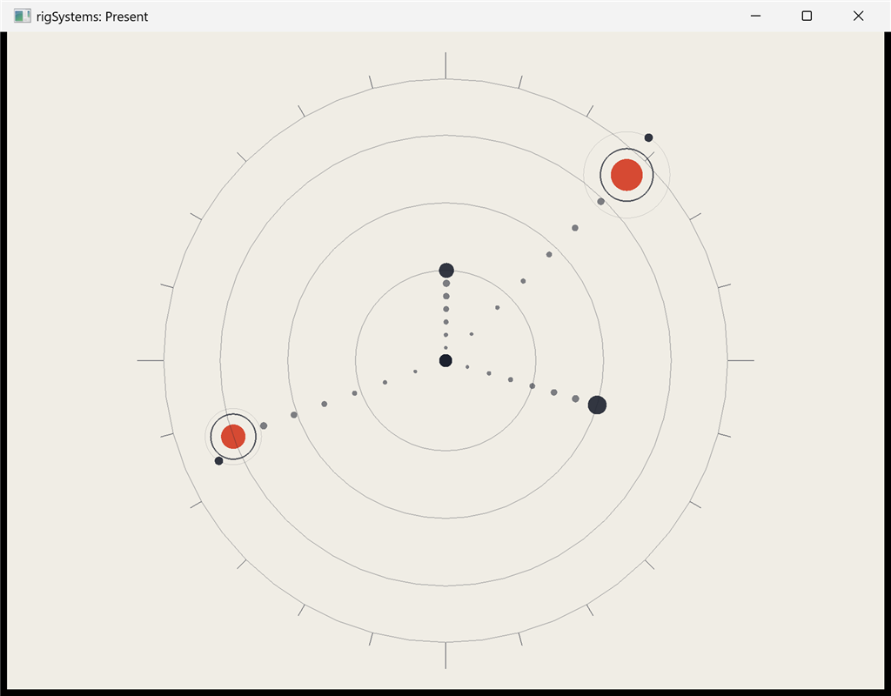

# rigSystems



ECS Update/Draw fulfillment over [rigComponent](https://github.com/rigkid/rigComponent) data.

## Example

[examples/present](examples/present/): Hierarchy orbit + Shapes.

```bash
cmake -S examples/present -B examples/present/build
cmake --build examples/present/build --target present
```

[API/docs](https://rigkid.github.io/rigSystems/)
